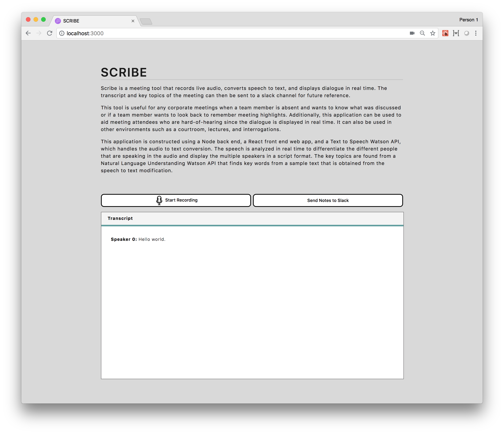

# SCRIBE

Scribe is a meeting tool that records live audio, converts speech to text, and displays dialogue in real time. The transcript and key topics of the meeting can then be sent to a slack channel for future reference.
This tool is useful for any corporate meetings when a team member is absent and wants to know what was discussed or if a team member wants to look back to remember meeting highlights. Additionally, this application can be used to aid meeting attendees who are hard-of-hearing since the dialogue is displayed in real time. It can also be used in other environments such as a courtroom, lectures, and interrogations.
This application is constructed using a Node back end, a React front end web app, and a Text to Speech Watson API, which handles the audio to text conversion. The speech is analyzed in real time to differentiate the different people that are speaking in the audio and display the multiple speakers in a script format. The key topics are found from a Natural Language Understanding Watson API that finds key words from a sample text that is obtained from the speech to text modification.

[Live Demo](https://scribe-comedic-wallaby.us-east.mybluemix.net/)

[Video Link](https://youtu.be/UTXNLBSqf38)

